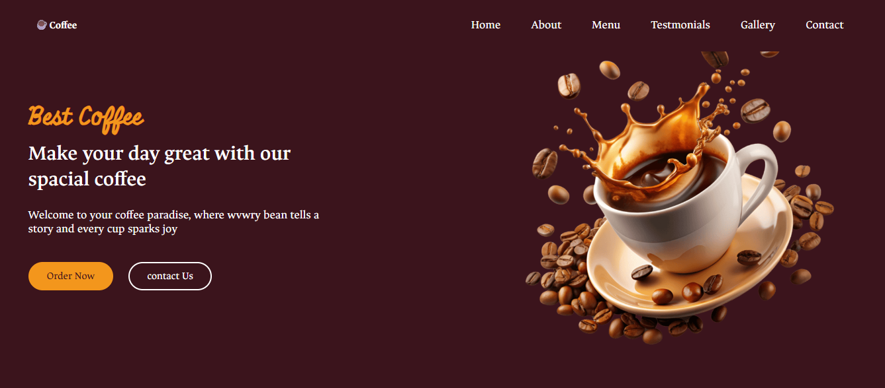

# Coffee Website ☕  

Projeto desenvolvido para praticar HTML, CSS e JavaScript.  
Inclui efeitos com Swiper.js e layout responsivo.  

## Tecnologias  
- HTML  
- CSS  
- JavaScript  
- Swiper.js  

## Como visualizar  

Acesse o site aqui: https://sonaite.github.io/Coffe-website/
